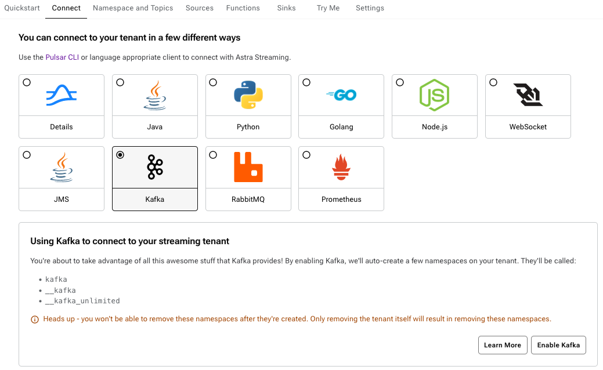

- [1. Scenario Overview](#1-scenario-overview)
  - [1.1. Scenario Programs](#11-scenario-programs)
- [2. Enable Pulsar's S4K Protocol Handler](#2-enable-pulsars-s4k-protocol-handler)
- [3. Deploy Pulsar Resources](#3-deploy-pulsar-resources)
  - [3.1. Kafka Topic Schema](#31-kafka-topic-schema)
- [4. Execution Steps](#4-execution-steps)
- [5. Verify the Results](#5-verify-the-results)

---

# 1. Scenario Overview

| | |
| - | - |
| **Name** | Kafka+S4K pubsub-basic |
| **Description** | This scenario shows how to use the Starlight for JMS (S4J) API with Pulsar to do native message producing and consuming with a **Kafka topic**. |
| **Data Flow Pattern** | <IoT_sensor_reading_data> -> [Kafka Producer] -> (Kafka topic) -> [Kafka Subscriber] |

## 1.1. Scenario Programs

There are 2 programs used in this scenario to demonstrate the end-to-end data flow pattern. All these programs are written in **Java**. 

| Name | Source Code | Description |
| ---- | ----------- | ----------- |
| IoTSensorKafkaConsumer | [IoTSensorKafkaConsumer.java](./src/main/java/com/example/pulsarworkshop/IoTSensorKafkaConsumer.java) | A Kafka producer client app that reads data from an IoT reading data source file (CSV format) and publishes the data to a Kafka topic which is backed by a Pulsar topic behind the scene. |
| IoTSensorKafkaProducer | [IoTSensorKafkaProducer.java](./src/main/java/com/example/pulsarworkshop/IoTSensorKafkaProducer.java) | A Kafka consumer client app that consumes messages from a Kafka topic which is backed by a Pulsar topic behind the scene. |

# 2. Enable Pulsar's S4K Protocol Handler

Apache Pulsar provides **native** support to other messaging/streaming clients (Kafka, RabbitMQ, etc.) through Pulsar's [**pluggable protocol handler**](https://github.com/apache/pulsar/wiki/PIP-41%3A-Pluggable-Protocol-Handler) capability. DataStax implements the Kafka protocol handler via the Starlight for Kafka (S4K).

By default, the S4K protocol handler is disabled in Pulsar. 

* For the general procedure of enabling S4K in Pulsar, please refer to this DataStax [document](https://docs.datastax.com/en/streaming/starlight-for-kafka/2.10.1.x/installation/starlight-kafka-quickstart.html)

* For Astra streaming in particular, enabling the S4K feature is as simple as just clicking a button on from the UI as below:


# 3. Deploy Pulsar Resources

In Pulsar, a Kafka topic is backed by a Pulsar topic. In this scenario, the following default Pulsar resources need to be deployed first before running the scenario: 

* **tenant**: `msgenrich`
* **namespace**: `testns`
* **topics**:
   * `msgenrich/testns/kafka_pubsub`

Please **NOTE** that the creation of the above Pulsar resources is done via the `deploy.sh` scrip. (see [Deploy a Scenario](../../../Deploy.Scenario.md) document for more details)

## 3.1. Kafka Topic Schema

In Pulsar, the built-in schema registry can be used for Kafka topic schema management. In this scenario, both the message key and value use `STRING` as the underlying schema.

# 4. Execution Steps

Let's assume the Pulsar cluster connection information is provided via the following file: `/tmp/client.conf`.

1. Deploy the scenario specific resources
```
deploy.sh -cc /tmp/client.conf
```

2. Start a Kafka message consumer and wait for consuming messages from a Kafka topic that is backed by the Pulsar topic `msgenrich/testns/kafka_pubsub`
```
runConsumer.sh -cc /tmp/client.conf -n 2 -t msgenrich/testns/kafka_pubsub
```

The received messages will be recorded in an application log file named `kafka-s4k-IoTSensorKafkaConsumer-YYYMMDD.log`. This log file is created in the current folder where the `runConsumer.sh` script is executed. An example of two outputs of this log file is as below: 

```
20:57:27.424 [main] INFO  c.e.p.IoTSensorKafkaConsumer - Starting application: "IoTSensorKafkaConsumer" ...
20:57:32.597 [main] INFO  c.e.p.IoTSensorKafkaConsumer - (mygroup) Message received and acknowledged: key=null; headers=RecordHeaders(headers = [], isReadOnly = false); value="1.5945120943859746E9","b8:27:eb:bf:9d:51","0.004955938648391245","51.0","false","0.00765082227055719","false","0.02041127012241292","22.7"
20:57:32.597 [main] INFO  c.e.p.IoTSensorKafkaConsumer - (mygroup) Message received and acknowledged: key=null; headers=RecordHeaders(headers = [], isReadOnly = false); value="1.5945120947355676E9","00:0f:00:70:91:0a","0.0028400886071015706","76.0","false","0.005114383400977071","false","0.013274836704851536","19.700000762939453"
20:57:32.646 [main] INFO  c.e.p.IoTSensorKafkaConsumer - Terminating application: "IoTSensorKafkaConsumer" ...
```

3. Start a Kafka message producer and publishes messages to a Kafka topic that is backed by the Pulsar topic `msgenrich/testns/kafka_pubsub`
```
runProducer.sh -cc /tmp/client.conf -n 2 -t msgenrich/testns/kafka_pubsub
```

The messages published will be recorded in an application log file named as `kafka-s4k-IoTSensorKafkaProducer-YYYMMDD.log`. This log file is created in the current folder where the `runProducer.sh` script is executed. An example of two outputs of this log file is as below: 

```
20:57:23.522 [main] INFO  c.e.p.IoTSensorKafkaProducer - Starting application: "IoTSensorKafkaProducer" ...
20:57:24.511 [main] INFO  c.e.p.IoTSensorKafkaProducer - Published a message with raw value: [0] "1.5945120943859746E9","b8:27:eb:bf:9d:51","0.004955938648391245","51.0","false","0.00765082227055719","false","0.02041127012241292","22.7"
20:57:24.511 [main] INFO  c.e.p.IoTSensorKafkaProducer - Published a message with raw value: [1] "1.5945120947355676E9","00:0f:00:70:91:0a","0.0028400886071015706","76.0","false","0.005114383400977071","false","0.013274836704851536","19.700000762939453"
20:57:24.824 [main] INFO  c.e.p.IoTSensorKafkaProducer - Terminating application: "IoTSensorKafkaProducer" ...
```

# 5. Verify the Results

This is a simple Kafka producer and consumer scenario without any extra message processing. The main purpose of this scenario is to demonstrate how to use Apache Pulsar as a drop-in replace of Apache Kafka and serve native Kafka client applications with no code change. 

The Kafka consumer client application receives exactly the same IoT sensor data that are published by the Kafka producer client application.