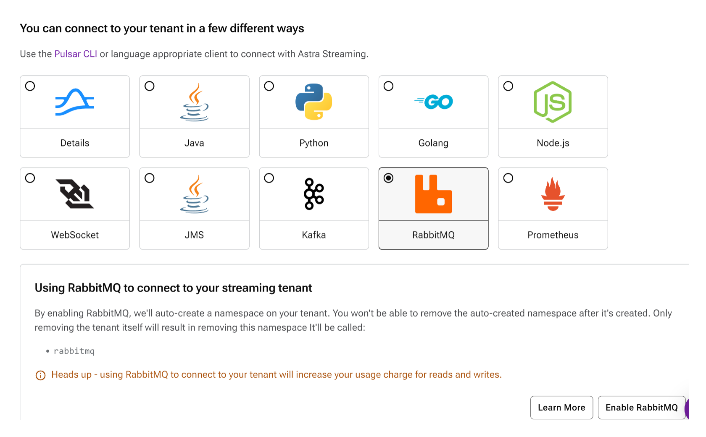

- [1. Scenario Overview](#1-scenario-overview)
  - [1.1. Scenario Programs](#11-scenario-programs)
  - [1.2. Enable RabbitMQ on Pulsar](#12-enable-rabbitmq-on-pulsar)
    - [1.3. Build the Programs](#13-build-the-programs)
- [2. Deploy the Pulsar Resources](#2-deploy-the-pulsar-resources)
- [3. Connect to the Pulsar Cluster](#3-connect-to-the-pulsar-cluster)
- [4. Execution Steps](#4-execution-steps)
  - [4.1. Run the RabbitMQ S4R Queue Consumer Client App](#41-run-the-rabbitmq-s4r-queue-consumer-client-app)
  - [4.2. Run the RabbitMQ S4R Queue Producer Client App](#42-run-the-rabbitmq-s4r-queue-producer-client-app)


# 1. Scenario Overview

| | |
| - | - |
| **Name** | pubsub-queue |
| **Description** | This scenario shows how to use the Starlight for RabbitMQ (S4R) API with Pulsar to do native message sending and receiving with a RabbitMQ queue hosted on Pulsar. |
| **Data Flow Pattern** |  [S4R Queue Producer] -> (Pulsar RabbitMQ queue) -> [S4R Queue Consumer] |

## 1.1. Scenario Programs

There are 2 programs used in this scenario to demonstrate the end-to-end data flow pattern. These programs are written in **Java**. 

| Name | Source Code | Description |
| ---- | ----------- | ----------- |
| S4RQueueProducer | [S4RQueueProducer.java](./src/main/java/com/example/pulsarworkshop/S4RQueueProducer.java) | A RabbitMQ producer client app that sends messages to a RabbitMQ queue which is backed by a Pulsar topic behind the scene. |
| S4RQueueConsumer | [S4RQueueConsumer.java](./src/main/java/com/example/pulsarworkshop/S4RQueueConsumer.java) | A RabbitMQ consumer client app that receives messages from a RabbitMQ queue which is backed by a Pulsar topic and subscription behind the scene. |


## 1.2. Enable RabbitMQ on Pulsar

[Starlight for RabbitMQ (S4R)](https://docs.datastax.com/en/streaming/astra-streaming/developing/astream-rabbit.html) brings native RabbitMQ protocol support to Apache Pulsar, enabling migration of existing RabbitMQ applications and services to Pulsar without modifying the code.  It implements the AMQP 0.9.1 protocol used by RabbitMQ clients and translates AMQP frames and concepts to Pulsar ones.  S4R can be implemented in the following methods:

* Standalone Proxy between your RabbitMQ clients and Pulsar
* Plugin protocol handler to Pulsar 
* Pulsar Proxy extension

For details on Starlight for RabbitMQ (S4R) implementation, see docs at: https://github.com/datastax/starlight-for-rabbitmq

Please **NOTE** for this scenario, you will need access to:
* Pulsar instance running with a Starlight for RabbitMQ implementation as stated above 
**OR**
* An Astra Streaming instance with RabbitMQ enabled.  It supports [S4R out-of-the-box](https://docs.datastax.com/en/streaming/astra-streaming/developing/astream-rabbit.html#starlight-for-rabbitmq-quickstart).  No setup required, 

### 1.3. Build the Programs

The above programs need to be built in advance before running this scenario. Please refer to the document of [Building the Scenarios](../../../Build.Programs.md) for more details.

# 2. Deploy the Pulsar Resources 

The scenario deployment script, [`deploy.sh`](_bash/deploy.sh), is used to execute the following tasks which are required before running the scenario.
1. Create the required Pulsar tenant (only relevant for non-Astra Streaming based Pulsar cluster)
2. Create the required Pulsar namespace
3. Create the required Pulsar topic

See [`Deploying the Scenario`](../../../Deploy.Scenario.md) doc for more details on the deploy script and options.

The deployment script needs the connection info to the target Pulsar cluster.  This `client.conf` or similar file is  described in this [Apache Pulsar doc](https://pulsar.apache.org/docs/2.10.x/reference-configuration/#client).  For Astra Streaming, it can be **download directly** from the UI under the "Connect" tab under "Details".

An example of using this script to deploy the scenario is as below, with the Pulsar Client Conf file in /tmp:

```
deploy.sh -cc /tmp/client.conf
```
In Pulsar, a RabbitMQ queue is backed by a Pulsar topic. Therefore, running this scenario requires a default Pulsar tenant, namespace, and topic.  For example:

* **tenant**: `mys4r`
* **namespace**: `rabbitmq`
* **topics**:
   * `mys4r/rabbitmq/s4rqueue`

# 3. Connect to the Pulsar Cluster

The RabbitMQ producer and consumer client apps can get connection info for the target Pulsar cluster from configuration file.  For this scenario, the client apps expect ths following parameters in a config file:

```
username:
password:
host:
port:
virtual_host:
amqp_URI: 
```

**NOTE** For Astra Streaming (AS), you can **download** the corresponding `rabbitmq.conf` from the UI under the "Connect" tab for "RabbitMQ".  This `rabbitmq.conf` is  populated with all required parameters, allowing for easy connection to Pulsar.

# 4. Execution Steps

After all Pulsar resources are deployed, we can run the S4R client applications included in this scenario.

## 4.1. Run the RabbitMQ S4R Queue Consumer Client App

The following script [`runConsumer.sh`](_bash/runConsumer.sh) is used to run the RabbitMQ S4R consumer client app that receives the messages from the RabbitMQ queue hosted on Pulsar.

An example of using this script to consuming 100 messages is as below:

```
runConsumer.sh -cc /tmp/rabbitmq.conf -n 100 -q s4rqueue
```
After the consumer starts, an example output is below:
```
bash-prompt$ ./runConsumer.sh -cc ../_config/rabbitmq.conf -n 10 -q s4rqueue

09:44:19.246 [main] INFO  c.e.pulsarworkshop.S4RQueueConsumer - SR4 Consumer created for queue s4rqueue running until 10 messages are received.
09:46:05.961 [pool-1-thread-4] INFO  c.e.pulsarworkshop.S4RQueueConsumer - SR4 Consumer received message count: 0 Message: This is a RabbitMQ message ********
09:46:06.051 [pool-1-thread-5] INFO  c.e.pulsarworkshop.S4RQueueConsumer - SR4 Consumer received message count: 1 Message: This is a RabbitMQ message ********

```
## 4.2. Run the RabbitMQ S4R Queue Producer Client App

The following script [`runProducer.sh`](_bash/runProducer.sh) is used to run the RabbitMQ S4R producer client app.

An example of using this script to publish 100 messages is as below:

```
runProducer.sh -cc /tmp/client.conf -n 100 -q mys4r/rabbitmq/s4rqueue
```
After running the producer, an example output is below:
```
bash-prompt$ ./runProducer.sh -cc ../_config/rabbitmq.conf -n 2 -q s4rqueue

09:46:05.755 [main] DEBUG c.e.pulsarworkshop.S4RQueueProducer - S4R Published a message: 0
09:46:05.954 [main] DEBUG c.e.pulsarworkshop.S4RQueueProducer - S4R Published a message: 1
```
